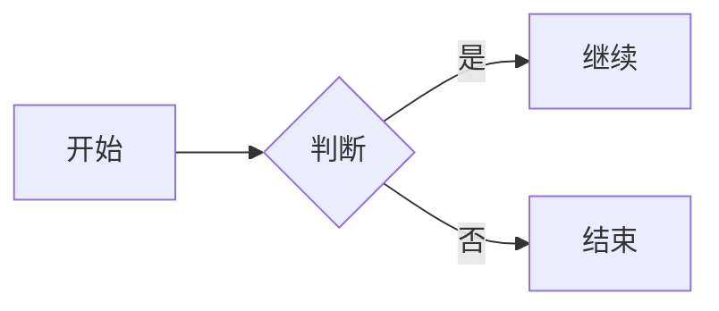
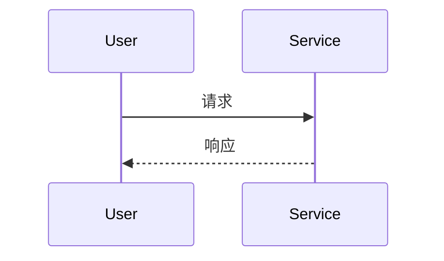
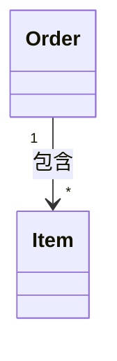
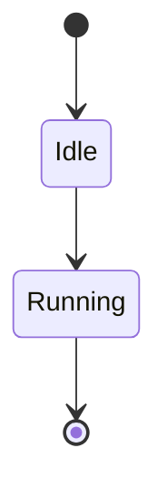
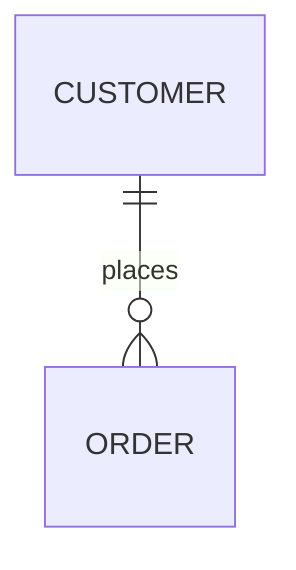

# Mermaid

使用此 skill 按 Mermaid 官方语法稳定生成图表，并优先保证可渲染性、可维护性和版本兼容性。

## 适用场景

- 需要从自然语言需求生成 Mermaid 图。
- 需要在已有 Mermaid 代码上做语法级修订。
- 需要按版本能力选择可用语法。
- 需要为不同图类型选择最小可渲染模板。
- 需要定位导致渲染失败的常见语法问题。

## 与 WaveDrom 的选择边界

- 参与者交互、流程控制、状态转移、类关系、实体关系：优先 Mermaid。
- bit-level 波形、采样边沿、寄存器位槽、事务时序：优先 WaveDrom。
- 若需求核心是“谁和谁交互、状态如何变化”，用 Mermaid。
- 若需求核心是“每个时钟周期线上是什么值”，不要用 Mermaid 硬画。

## 图类型速查

- `flowchart`：流程、模块关系、决策分支。
- `sequenceDiagram`：消息交互、调用顺序、参与者协作。
- `classDiagram`：类、接口、成员与关系。
- `stateDiagram-v2`：状态切换、子状态、起止态。
- `erDiagram`：实体、属性、关系基数。
- `gantt`：任务、阶段、依赖、计划时间线。

## 实践流程

1. 先确认图类型和目标受众，再决定语法深度。
2. 先产出最小可渲染代码，只保留声明和关键节点。
3. 再叠加样式、布局、主题和交互等增强项。
4. 如渲染失败，先排查声明、缩进、注释和保留字冲突。
5. 如存在版本约束，优先退回到低版本兼容语法。

## 核心模型

- Mermaid 代码通常由三部分组成：图类型声明、图内容定义、可选配置。
- 每个图都必须先声明类型，如 `flowchart`、`sequenceDiagram`、`erDiagram`。
- 部署级配置使用 `mermaid.initialize(...)`，单图配置使用 frontmatter `config:`；
  directive 仅作为旧图兼容入口。
- 优先输出“最小可渲染图”，再逐步叠加样式和高级特性。

## 语法总则

- 声明必须在图定义前出现，且拼写必须完全正确。
- 注释使用 `%%`，建议独立成行，避免与语法混写。
- frontmatter 使用 YAML，首尾用 `---`，缩进必须一致。
- 未知关键字与拼写错误可能直接导致图表失败。
- 复杂文本优先使用引号或 Markdown String，减少转义错误。

## 配置策略

- 全局部署配置优先使用 `mermaid.initialize(...)`。
- 单图配置优先使用 frontmatter `config:`。
- Directive `%%{ }%%` 自 v10.5.0 起已弃用，仅在维护旧图或目标渲染器不支持
  frontmatter 时使用。
- 交互能力如 `click`、`link` 需要结合 `securityLevel` 评估是否可用。

## 常见陷阱与规避

- Flowchart 中小写 `end` 可能触发解析问题，建议改写为 `End` 或 `END`。
- Flowchart 连线中节点以 `o` 或 `x` 开头时，易被识别为特殊边，需加空格或改写。
- Sequence、Flowchart 等图内注释若写在错误位置，可能吞掉后续语法。
- Frontmatter 的键名大小写与缩进错误会造成静默失效或解析失败。
- 复杂图不要一次性叠加过多特性，应逐段增量构建。

## 版本兼容策略

- 先确认目标渲染器及其 Mermaid 版本，再选择语法。
- 默认使用高频稳定语法；仅在需求明确时启用新图类型、`-beta` 类型或新特性。
- 版本相关语法下限查看[扩展语法速查](references/syntax-reference.md)，并以目标版本文档为准。
- 无法确认版本或实际渲染时，退回目标环境已知支持的最小语法。

## 验证闭环

1. 确认最终承载 Mermaid 的目标环境，而不只检查代码文本。
2. 优先使用 Maid 对 Mermaid 代码和 Markdown 中的 Mermaid 代码块做快速预检：
   默认通过 `npx maid <文件或目录>` 临时调用；全局安装后使用
   `mmd-maid <文件或目录>`。仅将 Maid 原生支持的图类型视为有效结果；
   pass-through 类型仍需目标渲染器验证。
3. 使用目标环境实际渲染每张新增或修改的图；环境中已有 `mmdc` 时，可用
   Mermaid CLI 补充验证。
4. 同一文档面向多个渲染器时，至少验证所有必须支持的渲染器。
5. 无法实际渲染时，明确标注未验证项，并移除非必要的新语法和增强配置。

## 输出质量门

- 必须经过目标环境实际渲染；无法验证时必须明确说明。
- 必须保留图类型声明与必要配置。
- 必须避免明显版本越界语法。
- 必须对关键语义节点使用稳定命名。
- 必须在复杂图中保留适量注释帮助维护。

## 最小模板速查

### Flowchart

### Sequence Diagram

### Class Diagram

### State Diagram

### Entity Relationship Diagram

### Gantt

## 模板使用建议

- 先复制最接近的模板并保持声明不变。
- 先改文案与节点，再改样式与主题。
- 涉及新语法时，先确认运行环境 Mermaid 版本。
- 低频图类型、扩展模板和版本下限统一查看
  [扩展语法速查](references/syntax-reference.md)。

## Markdown 场景建议

- Mermaid 代码嵌入 Markdown 时，应优先服务文档可读性。
- 与正文之间保持合理空行，避免围栏粘连。
- 若图较大，优先拆成多段主题图，减少单图认知负担。
- 仓库存在 Markdown lint 配置时，修改后运行对应检查。

## 进阶参考

- [扩展语法速查、低频模板和版本下限](references/syntax-reference.md)

## 参考来源

- [About Mermaid](https://mermaid.js.org/intro/)
- [Syntax Reference](https://mermaid.js.org/intro/syntax-reference.html)
- [Usage](https://mermaid.js.org/config/usage.html)
- [Directives](https://mermaid.js.org/config/directives.html)
- [Config Schema](https://mermaid.js.org/config/schema-docs/config.html)
- [Flowchart](https://mermaid.js.org/syntax/flowchart.html)
- [Sequence Diagram](https://mermaid.js.org/syntax/sequenceDiagram.html)
- [Class Diagram](https://mermaid.js.org/syntax/classDiagram.html)
- [State Diagram](https://mermaid.js.org/syntax/stateDiagram.html)
- [Entity Relationship Diagram](https://mermaid.js.org/syntax/entityRelationshipDiagram.html)
- [Gantt](https://mermaid.js.org/syntax/gantt.html)
- [Maid](https://github.com/probelabs/maid)
