# Mermaid 扩展语法速查

本参考补充 Mermaid 主 `SKILL.md` 未展开的低频图类型、扩展模板、版本下限和常见陷阱。主 `SKILL.md` 负责选型、版本意识与质量门；本参考负责查表和扩展示例，不替代 Mermaid 官方完整语法文档。

## 与主 Skill 的配合方式

- 主 `SKILL.md` 负责触发场景、图类型选型、版本意识、常见陷阱和质量门。
- 本文件负责低频图类型、扩展模板、配置入口和语法查表。
- 当你已经确定要用 Mermaid，但需要查扩展语法、找低频类型样例或确认配置写法时，优先查看本文件。

## Markdown 嵌入

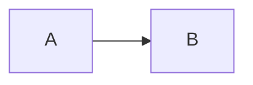

使用建议：

- 先写最小可渲染代码，再叠加样式和复杂结构。
- 单图特殊配置优先使用 frontmatter `config:`。
- Directive `%%{ }%%` 自 v10.5.0 起已弃用，仅用于维护旧图或兼容不支持
  frontmatter 的渲染器。

## 高频稳定图类型

### Flowchart

起始关键字：`flowchart` 或 `graph`。

- 方向：`TB`、`TD`、`BT`、`LR`、`RL`
- 连线：`-->`、`---`、`-.->`、`==>`
- 带标签连线：`A -->|text| B`
- 子图：`subgraph ... end`
- 样式：`classDef`、`class`、`style`、`linkStyle`

### Sequence Diagram

起始关键字：`sequenceDiagram`。

- 参与者：`participant`、`actor`
- 消息：`->`、`->>`、`-->`、`-->>`
- 激活：`activate`、`deactivate`
- 控制块：`loop`、`alt`、`opt`、`par`、`break`、`critical`

### State Diagram

起始关键字：`stateDiagram-v2`。

- 基本转移：`A --> B`
- 起止态：`[*] --> Idle`、`Done --> [*]`
- 复合状态：`state RUN { ... }`

### Class Diagram

起始关键字：`classDiagram`。

- 类定义：`class Device`
- 成员：`+init()`、`-state`
- 关系：继承、组合、依赖、关联

### ER Diagram

起始关键字：`erDiagram`。

- 关系基数：`||--o{`、`}|..|{` 等
- 属性列表建议在需要审阅数据结构时再展开，避免图过度拥挤

### Gantt

起始关键字：`gantt`。

- 元数据：`title`、`dateFormat`、`section`
- 任务依赖：`after task1`
- 状态标记：`crit`、`done`、`active`

## 低频与扩展图类型

以下类型默认迁出主 `SKILL.md`，仅在需求明确时使用。

### GitGraph

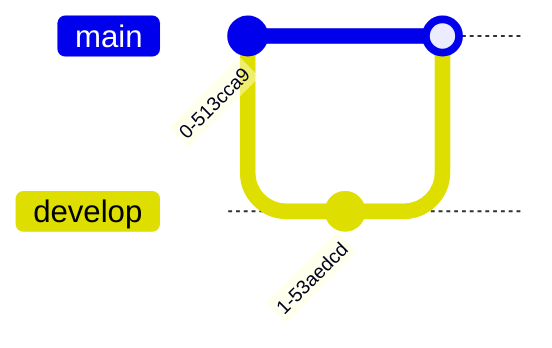

适用场景：分支演化、合并路径、发布节奏。

### Mindmap

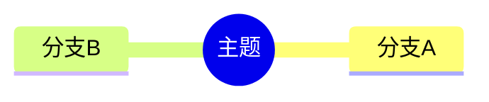

适用场景：发散式主题梳理、知识目录、问题拆解。

### Timeline

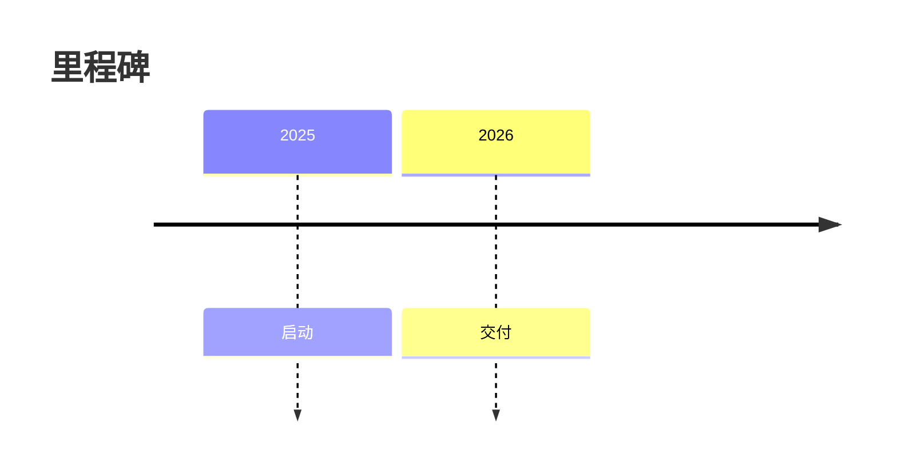

适用场景：版本演进、项目里程碑、历史节点。

### XY Chart

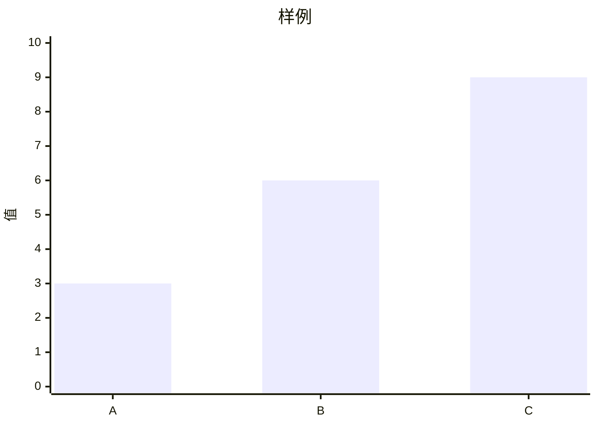

适用场景：简单定量比较。若要求精细统计图，请考虑专用图表工具。

### Kanban

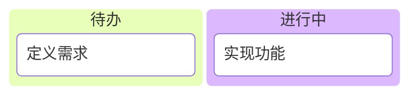

适用场景：轻量任务状态可视化。

### Packet

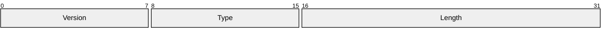

适用场景：简单协议字段布局。若需要严格 bit-level 时序与采样表达，应切换到 WaveDrom。

### Block

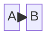

适用场景：块状布局、组件排布。

### Architecture

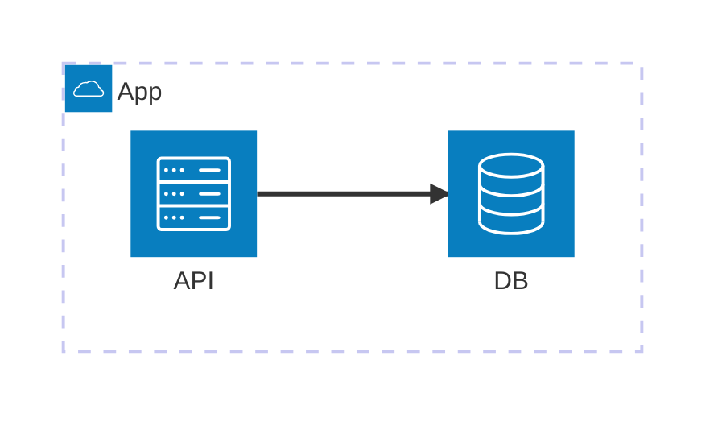

适用场景：部署视图、系统组件视图。

版本提醒：`architecture-beta` 需要 Mermaid v11.1.0+，使用前仍应确认目标渲染器版本。

### Radar

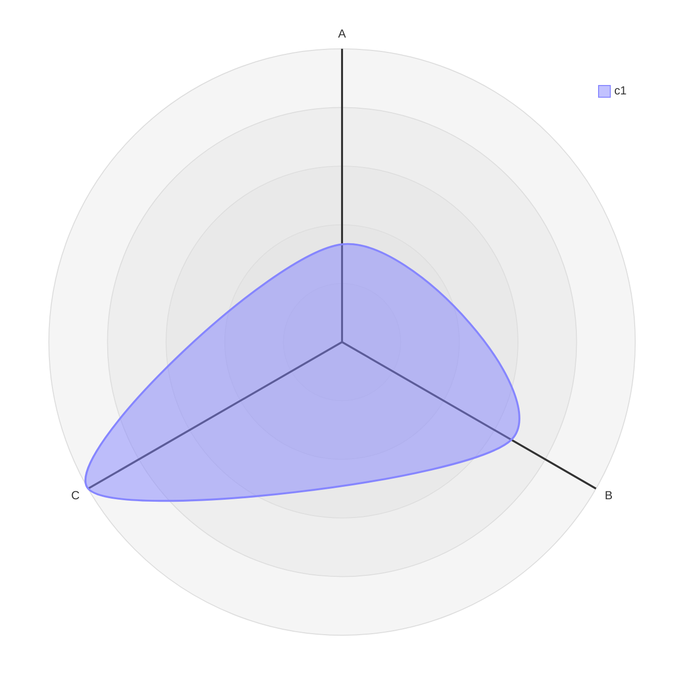

适用场景：多维指标粗略比较。

版本提醒：`radar-beta` 需要 Mermaid v11.6.0+，不确定环境时避免使用。

## 版本兼容速查

以下下限基于 Mermaid v11.16.1 官方文档。目标环境版本不同时，以目标版本文档和实际渲染结果为准。

- Packet 图需要 v11.0.0+，其中 `+<count>` 位宽语法需要 v11.7.0+。
- Flowchart 扩展形状与 `A@{ shape: rect }` 语法需要 v11.3.0+。
- Radar 图需要 v11.6.0+。
- Sequence 半箭头与中心连接需要 v11.12.3+。
- Timeline 方向参数需要 v11.14.0+。
- Sequence `autonumber <start> <increment>` 需要 v11.15.0+。
- Architecture `align row|column`、XY Chart 线图点标签和 ER 可选属性类型
  `type?` 需要 v11.16.0+。

## 配置入口速查

### `mermaid.initialize(...)`

适合全局部署配置。

### Frontmatter `config:`

适合单图配置，例如：

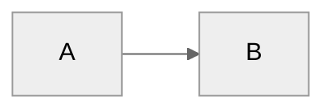

### Directive

自 Mermaid v10.5.0 起已弃用。仅在维护旧图或目标渲染器不支持 frontmatter
时保留，例如：

## 常见坑

- 不要把节点名直接写成小写 `end`。
- 不要在复杂图一开始就叠加主题、子图、交互和自定义类。
- 使用 `-beta` 类型前先确认运行环境版本。
- 图中文字过长时，优先缩短节点文本或拆成多图，不要把一张图塞成全文摘要。
- 需要时序采样、bit 值、片选生命周期时，不要继续停留在 Mermaid，应转向 WaveDrom。

## 参考来源

- [Mermaid Syntax Reference](https://mermaid.js.org/intro/syntax-reference.html)
- [Directives](https://mermaid.js.org/config/directives.html)
- [Flowchart](https://mermaid.js.org/syntax/flowchart.html)
- [Sequence Diagram](https://mermaid.js.org/syntax/sequenceDiagram.html)
- [State Diagram](https://mermaid.js.org/syntax/stateDiagram.html)
- [Class Diagram](https://mermaid.js.org/syntax/classDiagram.html)
- [Entity Relationship Diagram](https://mermaid.js.org/syntax/entityRelationshipDiagram.html)
- [Gantt](https://mermaid.js.org/syntax/gantt.html)
- [GitGraph](https://mermaid.js.org/syntax/gitgraph.html)
- [Mindmap](https://mermaid.js.org/syntax/mindmap.html)
- [Timeline](https://mermaid.js.org/syntax/timeline.html)
- [XY Chart](https://mermaid.js.org/syntax/xyChart.html)
- [Kanban](https://mermaid.js.org/syntax/kanban.html)
- [Packet](https://mermaid.js.org/syntax/packet.html)
- [Block](https://mermaid.js.org/syntax/block.html)
- [Architecture](https://mermaid.js.org/syntax/architecture.html)
- [Radar](https://mermaid.js.org/syntax/radar.html)
